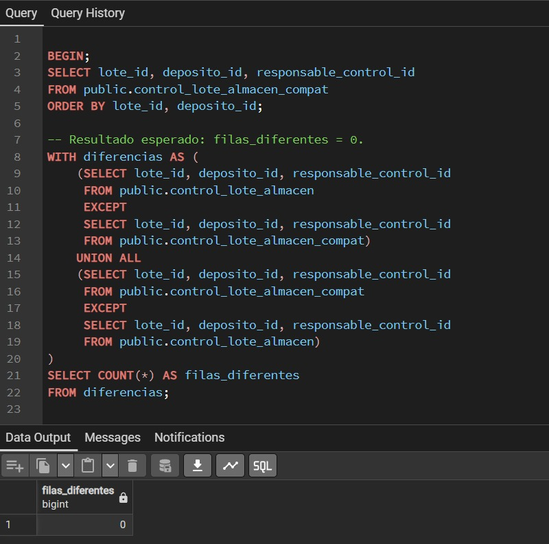
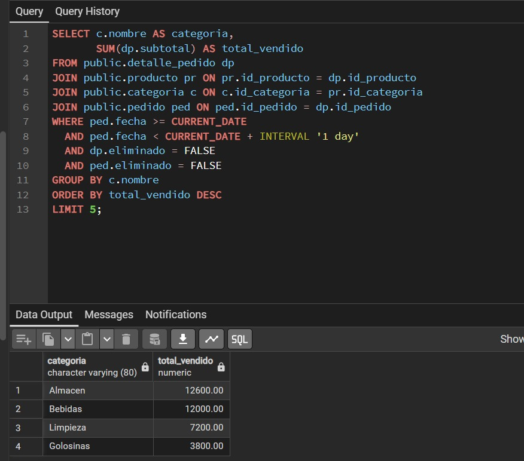
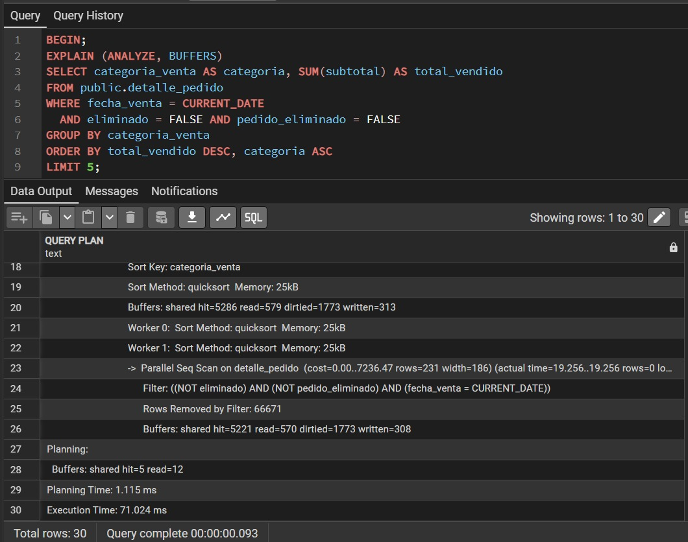
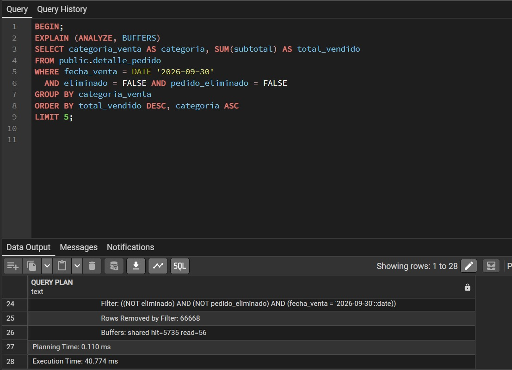
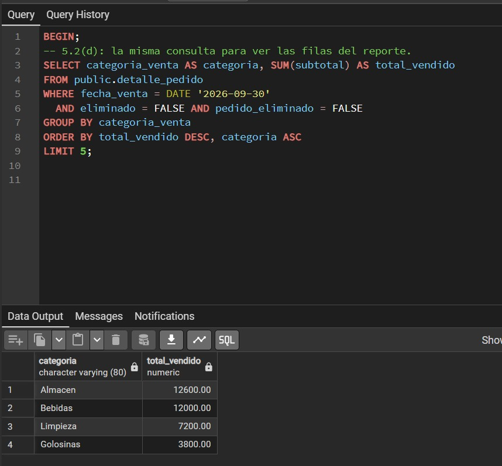
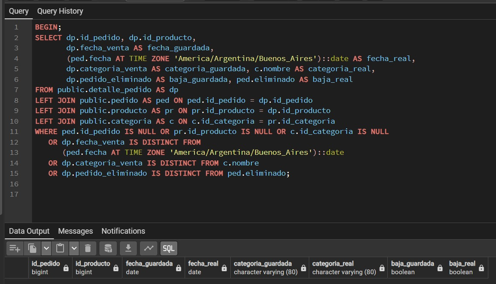

# Food Store

*Unidad 4 FNBC y desnormalización controlada*

## Presentación y alcance

Se resuelve el análisis de ControlLoteAlmacen mediante dependencias funcionales y descomposición a FNBC. Para el reporte de ventas diarias se propone una desnormalización controlada de detalle_pedido, con disparadores que mantienen las copias de sus datos relacionados. La decisión de rendimiento se evalúa con EXPLAIN ANALYZE sobre la misma copia poblada.

## Adaptación de la consulta al esquema de Food Store

El SQL del enunciado usa nombres distintos de los del archivo base_food_store(1).sql. Se emplean las siguientes equivalencias para ejecutar el trabajo en foodstorecopia:

| Enunciado | Esquema proporcionado |
| :--- | :--- |
| categoria.id | categoria.id_categoria |
| producto.id | producto.id_producto |
| producto.categoria_id | producto.id_categoria |
| pedido.id | pedido.id_pedido |
| detalle_pedido.producto_id | detalle_pedido.id_producto |
| detalle_pedido.pedido_id | detalle_pedido.id_pedido |

pedido.fecha es timestamp with time zone. El día se filtra con un intervalo desde la medianoche hasta la siguiente, en la zona America/Argentina/Buenos_Aires. Se incorporan eliminado en pedido y detalle_pedido, con valor inicial FALSE, para aplicar la baja lógica indicada en la consigna.

Los scripts se ejecutan desde Query Tool conectado a foodstorecopia. Usan public y no requieren crear otro esquema. El primero reutiliza las tablas de la Parte 1 si ya existen con las definiciones del ejercicio.

Ejecutar primero tp_fnbc_control_lote.sql. En el segundo archivo, avanzar por secciones A a F y conservar las salidas de B, D y E antes de continuar con la siguiente sección.

## 4 Parte 1 Análisis de FNBC

### a Dependencias funcionales

Sea C = ControlLoteAlmacen(LoteID, DepositoID, ResponsableControlID). Las reglas de negocio determinan el siguiente conjunto de dependencias:

$$\{LoteID, DepositoID\} \to ResponsableControlID$$

$$ResponsableControlID \to DepositoID$$

La primera regla designa un único responsable para cada par de lote y depósito. La segunda expresa que cada responsable pertenece a un solo depósito. Estas reglas provienen del dominio y deben cumplirse en todas las instancias válidas.

### b Clausuras y claves candidatas

Se abrevia L = LoteID, D = DepositoID y R = ResponsableControlID. Con F = {LD → R, R → D}, las clausuras son:

| Conjunto X | Clausura X⁺ | Clasificación |
| :--- | :--- | :--- |
| ∅ | ∅ | No es superclave |
| {L} | {L} | No es superclave |
| {D} | {D} | No es superclave |
| {R} | {R, D} | No es superclave |
| {L, D} | {L, D, R} | Clave candidata |
| {L, R} | {L, R, D} | Clave candidata |
| {D, R} | {D, R} | No es superclave |
| {L, D, R} | {L, D, R} | Superclave no mínima |

Las claves candidatas son {LoteID, DepositoID} y {LoteID, ResponsableControlID}. Ambas determinan todos los atributos y son mínimas, pues ninguno de sus atributos aislados es superclave. No hay otras claves candidatas: L debe estar presente porque no puede obtenerse mediante F; para completar su clausura debe agregarse D o R.

Los tres atributos son primos porque cada uno aparece en alguna clave candidata. No hay atributos no primos.

### c Violación de FNBC

FNBC exige que, para toda dependencia funcional no trivial X → Y, el determinante X sea superclave. LD → R cumple este criterio. R → D lo viola: R⁺ = {R, D} no contiene L, por lo que R no es superclave. En consecuencia, ControlLoteAlmacen no cumple FNBC, aunque sus tres atributos sean primos.

### d Anomalías de la instancia original

#### Inserción

Se incorpora el responsable 803 al depósito 32, pero todavía no se le asigna ningún lote. No puede registrarse únicamente esa pertenencia en control_lote_almacen, porque lote_id es obligatorio y forma parte de la clave primaria. Guardar un dato maestro de personal requiere esperar a un control de lote o introducir un lote ficticio.

#### Borrado

El responsable 802 aparece solo en (503, 31, 802). Si se borra esa fila porque ya no se controla el lote 503, también se pierde la única pertenencia de 802 al depósito 31 registrada en esta relación. El borrado del control elimina información independiente sobre el personal.

#### Actualización

El responsable 801 aparece en (501, 30, 801) y (502, 30, 801). Si se corrige su depósito a 33, deben modificarse ambas filas. Una modificación parcial produciría (501, 33, 801) y (502, 30, 801), asociando el mismo responsable a dos depósitos y violando R → D. Se supone que el depósito 33 existe en la tabla maestra.

### e Descomposición a FNBC

Se aplica el algoritmo a la dependencia violatoria X → Y, con X = {R} e Y = {D}. Las relaciones resultantes son C₁ = X ∪ Y y C₂ = C − (Y − X):

$$C_1 = ResponsableDeposito(ResponsableControlID, DepositoID)$$

$$C_2 = ControlLote(LoteID, ResponsableControlID)$$

ResponsableDeposito tiene PK(responsable_control_id) y claves foráneas hacia usuario(id) y deposito(id). ControlLote tiene PK(lote_id, responsable_control_id), y claves foráneas hacia lote(id) y ResponsableDeposito. En C₁, R → D tiene como determinante una clave. En C₂ no se proyectan dependencias no triviales con determinante menor que {L, R}. Ambas relaciones cumplen FNBC.

### f Reunión sin pérdida

C₁ ∩ C₂ = {ResponsableControlID}. El criterio de descomposición binaria sin pérdida exige que el conjunto común determine una de las relaciones. En F⁺ se cumple:

$$\{ResponsableControlID\} \to \{ResponsableControlID, DepositoID\} = C_1$$

El atributo común es clave de ResponsableDeposito. Por ello, reunir las proyecciones de cualquier instancia original válida recupera exactamente esa instancia, sin agregar tuplas espurias.

### Migración y verificación de la Parte 1

El archivo tp_fnbc_control_lote.sql contiene las tablas maestras mínimas, la relación original, la instancia de ejemplo, las tablas descompuestas y las restricciones PK y FK. Incluye BEGIN y COMMIT en el mismo bloque y una comprobación automática de equivalencia.

```sql
CREATE TABLE responsable_deposito (
    responsable_control_id BIGINT NOT NULL,
    deposito_id BIGINT NOT NULL,
    CONSTRAINT pk_responsable_deposito
        PRIMARY KEY (responsable_control_id),
    CONSTRAINT fk_responsable_usuario
        FOREIGN KEY (responsable_control_id) REFERENCES usuario(id),
    CONSTRAINT fk_responsable_deposito
        FOREIGN KEY (deposito_id) REFERENCES deposito(id)
);

CREATE TABLE control_lote (
    lote_id BIGINT NOT NULL,
    responsable_control_id BIGINT NOT NULL,
    CONSTRAINT pk_control_lote
        PRIMARY KEY (lote_id, responsable_control_id),
    CONSTRAINT fk_control_lote_lote
        FOREIGN KEY (lote_id) REFERENCES lote(id),
    CONSTRAINT fk_control_lote_responsable
        FOREIGN KEY (responsable_control_id)
        REFERENCES responsable_deposito(responsable_control_id)
);

-- Proyecciones de los datos originales
INSERT INTO responsable_deposito
    (responsable_control_id, deposito_id)
SELECT DISTINCT responsable_control_id, deposito_id
FROM control_lote_almacen;

INSERT INTO control_lote (lote_id, responsable_control_id)
SELECT DISTINCT lote_id, responsable_control_id
FROM control_lote_almacen;

-- Reunion natural sobre responsable_control_id
CREATE VIEW control_lote_almacen_compat AS
SELECT cl.lote_id, rd.deposito_id, responsable_control_id
FROM control_lote AS cl
NATURAL JOIN responsable_deposito AS rd;

COMMIT;
```

La única columna común de las dos tablas es responsable_control_id. DISTINCT evita duplicar la pertenencia (801, 30). Si las tablas ya estaban creadas, la verificación final detecta diferencias entre su contenido y la relación original.

#### Resultado esperado de la vista

| lote_id | deposito_id | responsable_control_id |
| :--- | :--- | :--- |
| 501 | 30 | 801 |
| 502 | 30 | 801 |
| 503 | 31 | 802 |

Para la instancia de ejemplo se esperan dos filas en responsable_deposito, tres en control_lote y filas_diferentes = 0. CREATE VIEW define la consulta; las filas se muestran al ejecutar SELECT sobre la vista.

Evidencia de ejecución: insertar la captura de la vista y de filas_diferentes = 0 obtenidas en foodstorecopia.

La descomposición no preserva localmente LD → R: las PK y FK permiten dos responsables del mismo depósito para un lote. Para mantener esa regla en nuevas altas se necesita un control adicional entre tablas. Esta limitación no contradice la prueba de reunión sin pérdida.



## 5 Parte 2 Desnormalización controlada

### a Consulta normalizada y medición inicial

El reporte obtiene hasta cinco categorías por monto vendido durante el día y excluye pedidos y detalles eliminados. Se agrupa por nombre como en el enunciado; ambos reportes usan el mismo criterio de desempate.

```sql
SELECT c.nombre AS categoria,
       SUM(dp.subtotal) AS total_vendido
FROM public.detalle_pedido dp
JOIN public.producto pr ON pr.id_producto = dp.id_producto
JOIN public.categoria c ON c.id_categoria = pr.id_categoria
JOIN public.pedido ped ON ped.id_pedido = dp.id_pedido
WHERE ped.fecha >= CURRENT_DATE
  AND ped.fecha < CURRENT_DATE + INTERVAL '1 day'
  AND dp.eliminado = FALSE
  AND ped.eliminado = FALSE
GROUP BY c.nombre
ORDER BY total_vendido DESC
LIMIT 5;
```



#### Instancia razonablemente poblada

La sección A del segundo script contiene una carga configurable para la copia de trabajo. Si hay menos de 1000 pedidos del día y v_cargar_datos = TRUE, agrega 20000 pedidos y hasta 200000 detalles, usando los primeros diez productos disponibles. Con menos productos, la cantidad de detalles será menor. Los pedidos se vinculan a un cliente identificado como prueba de la Unidad 4.

Con v_cargar_datos = FALSE se omite esa carga. La sección A informa los conteos reales de pedidos, detalles y pedidos del día. Esos valores deben acompañar las capturas para describir el volumen efectivamente medido. La base original de producción no se usa para esta prueba.

#### Criterio de lectura del plan

Se registra Execution Time en milisegundos. Los valores cost son estimaciones del planificador, no tiempos reales. Se identifica el recorrido, la reunión o la agregación que concentra el trabajo, revisando actual time, rows, loops y buffers. El costo de los nodos superiores incluye a sus hijos; no se debe confundir el nodo Limit con la operación que origina el costo.

Para reducir el efecto de la primera ejecución, repetir tres veces cada consulta y comparar la mediana bajo el mismo volumen, día, sesión y ausencia de escrituras concurrentes. Conservar una captura representativa de cada plan y los tres tiempos.

### b Elección del patrón y justificación

Se propone el patrón de columnas precalculadas con disparadores: fecha_venta, categoria_venta y pedido_eliminado se mantienen en detalle_pedido para resolver el reporte sin recorrer las otras tres tablas. La decisión se valida con el tiempo y el nodo dominante registrados en el apartado a y su comparación con el apartado d; solo se justifica por rendimiento si la medición evidencia un ahorro para la frecuencia del panel. Los disparadores recalculan las copias al insertar o modificar detalles y propagan los cambios de pedido, producto y categoría dentro de la misma transacción. El diseño es reversible: se pueden retirar las columnas redundantes y sus disparadores conservando todas las tablas y los hechos originales de las ventas.

### c Estructura y mecanismo de sincronización

```sql
LOCK TABLE public.pedido, public.detalle_pedido,
    public.producto, public.categoria IN SHARE ROW EXCLUSIVE MODE;
ALTER TABLE public.detalle_pedido
    ADD COLUMN IF NOT EXISTS fecha_venta DATE,
    ADD COLUMN IF NOT EXISTS categoria_venta VARCHAR(80),
    ADD COLUMN IF NOT EXISTS pedido_eliminado BOOLEAN;
```

La sección C del script bloquea temporalmente las escrituras en las cuatro tablas, carga los valores derivados y establece NOT NULL antes de habilitar el funcionamiento habitual. La fuente de verdad sigue siendo pedido.fecha, pedido.eliminado y categoria.nombre, enlazados por las claves de producto y detalle_pedido.

| Objeto modificado | Evento | Acción de sincronización |
| :--- | :--- | :--- |
| detalle_pedido | INSERT o UPDATE | BEFORE calcula las tres copias |
| pedido | UPDATE de fecha o eliminado | AFTER actualiza sus detalles |
| producto | UPDATE de id_categoria | AFTER recalcula sus detalles |
| categoria | UPDATE de nombre | AFTER propaga el nombre |

El disparador BEFORE lee los registros maestros con FOR SHARE, para no copiar valores de una fila mientras otro escritor la modifica. Una corrección manual de los campos redundantes se reemplaza por los valores obtenidos de sus fuentes. Las bajas físicas de detalles eliminan sus copias; el borrado de pedidos conserva el comportamiento ON DELETE CASCADE de la base.

subtotal ya es una columna generada almacenada en el esquema original. No se modifica ni se vuelve a almacenar otro total: el nuevo reporte suma esos subtotales con los datos relacionados que se copiaron de forma controlada.

#### Costo y alcance del diseño

El índice parcial de fecha_venta incluye categoria_venta y subtotal para favorecer las lecturas de ventas vigentes. Los cambios de categoría o de nombre pueden actualizar muchos detalles; ese costo de escritura y el espacio adicional se consideran junto con el ahorro medido en lecturas. El nombre de categoría refleja la clasificación actual, exactamente como la consulta normalizada, y no una clasificación histórica independiente.

El archivo tp_desnormalizacion_top_categorias.sql incluye la definición completa de las cuatro funciones, sus disparadores, la carga inicial y los índices. El patrón mantiene los datos sin un proceso de refresco periódico.



### d Consulta directa sobre la estructura desnormalizada

```sql
EXPLAIN (ANALYZE, BUFFERS)
SELECT categoria_venta AS categoria,
       SUM(subtotal) AS total_vendido
FROM public.detalle_pedido
WHERE fecha_venta = CURRENT_DATE
  AND eliminado = FALSE
  AND pedido_eliminado = FALSE
GROUP BY categoria_venta
ORDER BY total_vendido DESC, categoria ASC
LIMIT 5;
```

Esta consulta lee directamente detalle_pedido, sin los tres JOIN del reporte original. Conserva la selección del día, las bajas lógicas, la agrupación por nombre, la suma de subtotales y el límite de cinco categorías. El plan real decidirá entre los accesos disponibles según el volumen y las estadísticas.





### e Auditoría del dato redundante

La sección E crea la vista tp_u4_auditoria_desnormalizacion. Compara fila por fila las tres copias contra pedido, producto y categoria usando IS DISTINCT FROM, que también detecta diferencias con NULL. Incluye la detección de referencias faltantes mediante LEFT JOIN.

```sql
SELECT dp.id_pedido, dp.id_producto,
       dp.fecha_venta AS fecha_guardada,
       (ped.fecha AT TIME ZONE 'America/Argentina/Buenos_Aires')::date AS fecha_real,
       dp.categoria_venta AS categoria_guardada, c.nombre AS categoria_real,
       dp.pedido_eliminado AS baja_guardada, ped.eliminado AS baja_real
FROM public.detalle_pedido AS dp
LEFT JOIN public.pedido AS ped ON ped.id_pedido = dp.id_pedido
LEFT JOIN public.producto AS pr ON pr.id_producto = dp.id_producto
LEFT JOIN public.categoria AS c ON c.id_categoria = pr.id_categoria
WHERE ped.id_pedido IS NULL OR pr.id_producto IS NULL OR c.id_categoria IS NULL
   OR dp.fecha_venta IS DISTINCT FROM
       (ped.fecha AT TIME ZONE 'America/Argentina/Buenos_Aires')::date
   OR dp.categoria_venta IS DISTINCT FROM c.nombre
   OR dp.pedido_eliminado IS DISTINCT FROM ped.eliminado;
```

Resultado esperado después de la migración: cero filas. Cada fila devuelta identifica el pedido y el producto afectados, junto con sus valores guardados y reales. Debe incorporarse al informe una captura de la ejecución que muestre el resultado vacío.



#### Equivalencia de ambos reportes

Además de la auditoría por fila, el script compara con EXCEPT los resultados completos agrupados, antes de LIMIT, en ambos sentidos. El resultado esperado es diferencias_reporte = 0. La comprobación previa al límite permite detectar diferencias que podrían quedar ocultas fuera del top 5.

#### Pruebas de sincronización

La sección F inserta un caso nuevo, cambia la categoría del producto, renombra la categoría, modifica la fecha y la baja del pedido y actualiza el precio del detalle. Verifica las copias, el subtotal generado y la auditoría después de esos cambios. Si todo coincide, emite el aviso Pruebas de insercion y propagacion correctas. Los datos de la prueba se deshacen con ROLLBACK; los identificadores consumidos por las secuencias pueden quedar sin uso.

Evidencias a incorporar: plan posterior, auditoría vacía, diferencias_reporte = 0 y mensaje de pruebas correctas.
